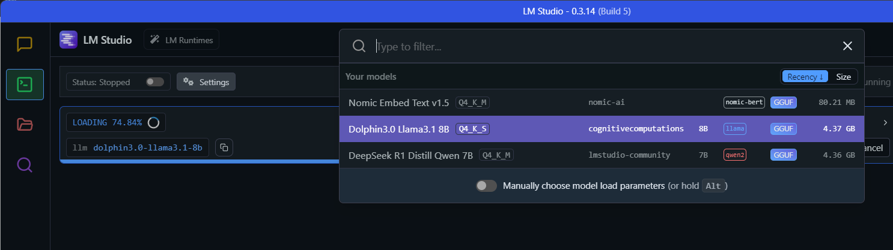
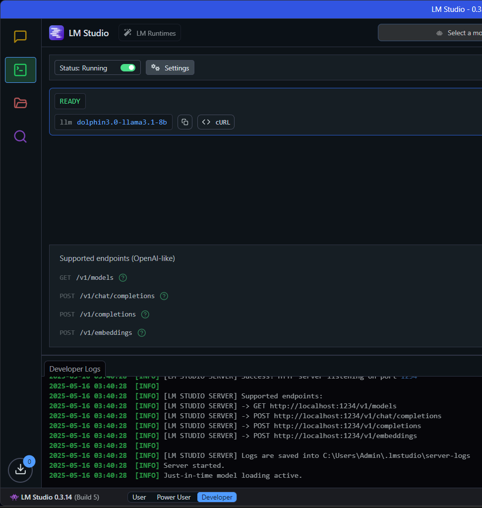

# Insights AI: Local LLM SQL Assistant

## Overview
Insights AI is a local Streamlit application that leverages a fine-tuned LLM (via LM Studio) and PostgreSQL to translate natural-language problem statements into safe, efficient and executable SQL queries. You can use this to directly get results from your data through natural language input without the need of writing SQL queries. It follows core system-prompting principles to ensure accuracy and performance. it also has the option to dsiplay Plotly-based graphs and plots as and when needed.

## Key Features

- **Natural-Language to SQL**: Converts user prompts into pure, single-line PostgreSQL queries without extraneous labels or explanations
- **No internet access needed**: Ensuring data privacy
- **Schema-Aware Generation**: Embeds table and column definitions in the prompt for context
- **Query Safety**: Enforces rules to prevent destructive commands (no `DROP`, `DELETE`), uses `ILIKE` for case-insensitive matching
- **Automated Formatting**: Post-processes LLM output to correct spacing, restore string literals, and append wildcards
- **Interactive UI**: Streamlit-based chat interface with data preview and Plotly-powered visualizations (Bar, Line, Scatter, Pie)
- **Modular Design**: Clear separation of database connectivity, prompt generation, SQL cleaning, and UI components
- Pluggable database backend (PostgreSQL out-of-the-box)
- Easily configurable system prompt and schema context
- LM Studio integration with local inference

## Architecture

```
    A[Streamlit UI] -->|1. User Input| B[Promptizer];
    B -->|2. Prompt + Schema| C[LM Studio Completion];
    C -->|3. Raw SQL Output| D[SQL Cleaner];
    D --> E[DB Exec];
    E --> F[Results];
```

## Prerequisites

- Python 3.8 or higher
- PostgreSQL (local instance) - make sure your data is present in a postgres schema.
  
- LM Studio running locally with a compatible model (e.g., `dolphin3.0-llama3.1-8b`)

## Installation

1. Clone the repository:
   ```bash
   git clone https://github.com/gaurisharan/insights-local-ai.git
   cd insights-local-ai

2. Create and activate a virtual environment:
   ```bash
   python -m venv venv
   source venv/bin/activate

3. Install dependencies:
   ```bash
   pip install -r requirements.txt

### Configuration

Update `DB_CONFIG` in `app.py` (or your main script) with your PostgreSQL credentials:

  ```python
  DB_CONFIG = {
      "dbname": "postgres",       # Your database name
      "user": "username",         # Your PostgreSQL username
      "password": "yourpassword", # Your PostgreSQL password
      "host": "localhost",        # Usually 'localhost'
      "port": "5432",             # Default PostgreSQL port
  }
```

### Prompt & API Configuration

- Ensure `SYSTEM_PROMPT` and `SCHEMA_INFO` reflect your current database schema.

- Configure LM Studio

  

  Go to the developer tab on the left panel. Then go to the top bar "Select a model to load" and choose your preferred model. Wait for it to load.

  

  Toggle the status option at the top to "Running". Use the API generated in your code.

- Confirm the LM Studio API endpoint and model in the `generate_sql_query` function:

```python
url = "http://localhost:1234/v1/completions"  # LM Studio API URL

payload = {
    "model": "dolphin3.0-llama3.1-8b",  # Replace with your preferred model
    "prompt": prompt,
    "max_tokens": 256,
    "temperature": 0.2
}
```

## Usage
1. Launch the Streamlit app:

```bash
streamlit run app.py
```

2. In your browser, enter a natural-language SQL request (for example: Show me all transactions after 2024-01-01 for ICICI Bank)

3. Inspect the generated SQL, view results in a table, and optionally create charts

## Example Session
User: List distinct name and count of transactions grouped by date where amount > 1000

System: Generates and executes a query such as:

```sql
SELECT txn_date, COUNT(*) FROM transactions WHERE txn_amount > 1000 GROUP BY txn_date;
```

Output: Dataframe with counts per date and a corresponding Plotly bar chart

## Code Organization
1. app.py: Main Streamlit script, handles UI, orchestration, and plotting

5. requirements.txt: Python dependencies


## Extending RAG
To incorporate Retrieval-Augmented Generation:

1. Store embeddings of SQL documentation or sample queries in a vector store

2. On each prompt, retrieve top-k relevant documents and include them in the LM prompt

3. Adjust generate_sql_query to merge retrieval context with schema info

## Contributing
Contributions welcome via pull requests—feel free to open issues for feature requests or bugs

## License
Distributed under the MIT License. See LICENSE for details.


